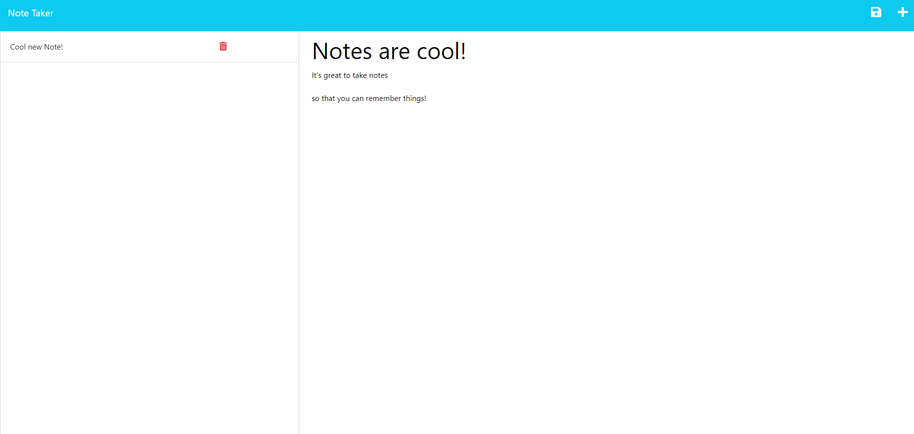

# Note Taker

## Description

This project lets you take notes and saves it to a backend-server via heroku

## Table of Contents

- [Installation](#installation)
- [Usage](#usage)
- [License](#license)
- [Contributions](#contributions)
- [Questions](#questions)

## Installation

Just follow the heroku link and enjoy! Or enjoy on your own localhost by downloading the files, running npm i, and using node server.js.

## Usage

Keep track of all of your notes with this easy-to-use app!

## License

This application is covered under the MIT license. Read more at [License: MIT](https://opensource.org/licenses/MIT)

## Contributions

Just email me at sciclunajl@gmail.com with ideas or opportunities

## Questions

1. Where can I find your github so that I can view your other projects? https://github.com/scicluna

2. What email address should I use to contact you regarding further opportunities or questions? sciclunajl@gmail.com
